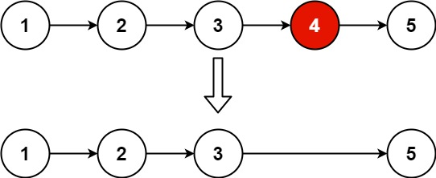
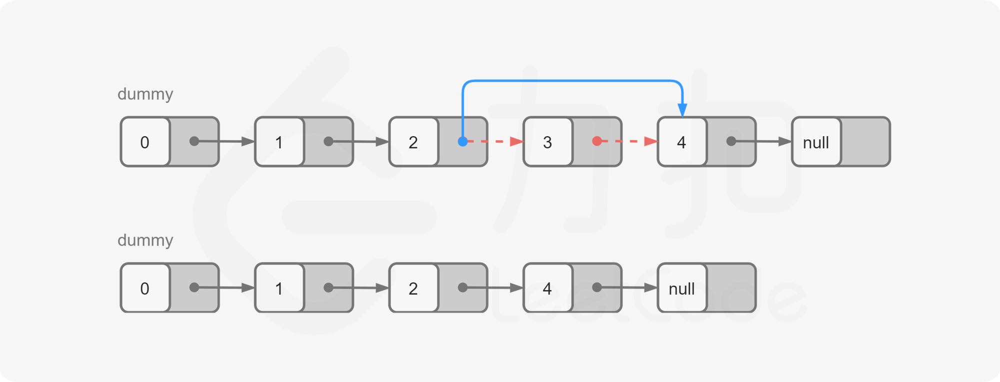
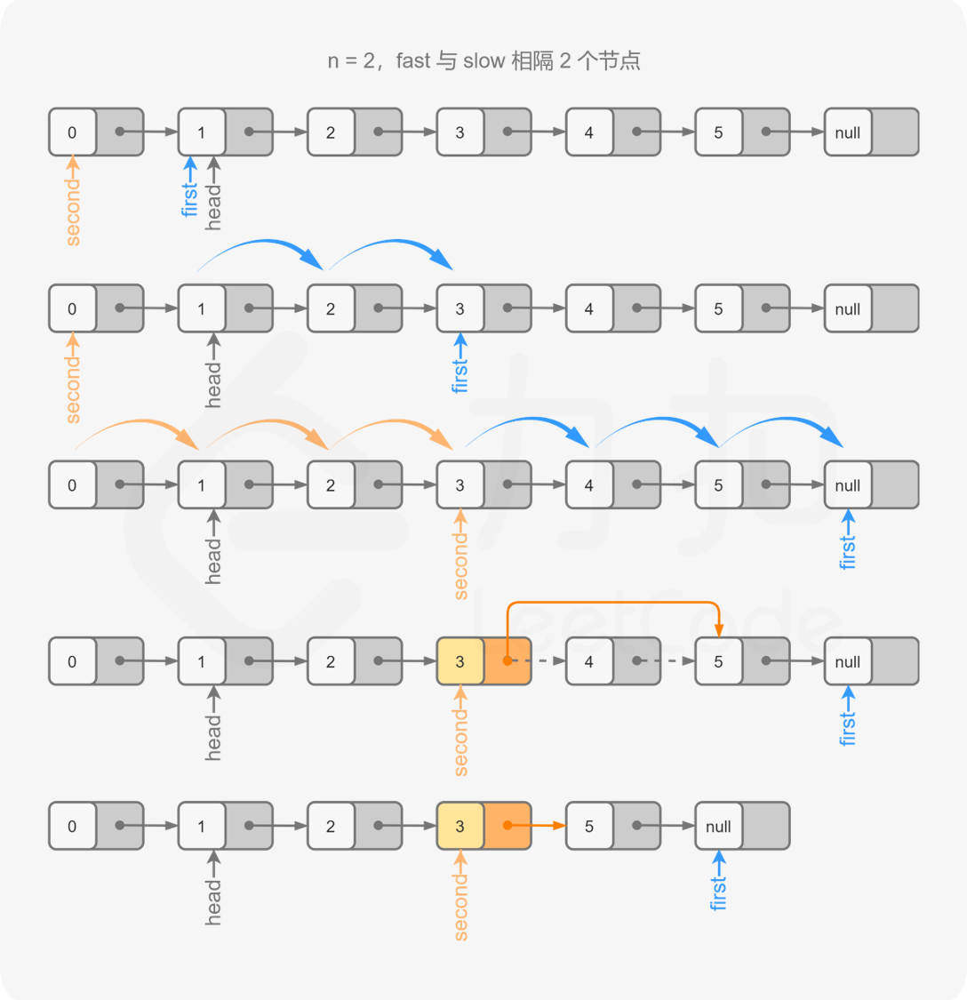
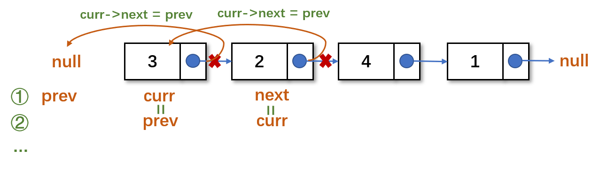

# Leetcode 题目

| 题目                                                         | 代码                                               | 标签                                                        | 难度 | 时间 |
| ------------------------------------------------------------ | -------------------------------------------------- | ----------------------------------------------------------- | ---- | ---- |
| [1.两数之和](#1两数之和)                                     | [C++](1.两数之和.cpp)                              |                                                             | 🟢    | 1-12 |
| [2.两数相加](#2两数相加)                                     | [C++](LinkedList/2两数相加.cpp)                   | [链表](#链表) 模拟                                          | 🟡    | 1-15 |
| [9.回文数](#9回文数)                                         | [C++](9.回文数.cpp)                                |                                                             | 🟢    | 1-12 |
| [19.删除链表的倒数第n个结点](#19删除链表的倒数第n个结点)     | [C++](LinkedList/19.删除链表的倒数第-n-个结点.cpp)            | [链表](#链表) [双指针](#双指针) [栈](#栈)                   | 🟡    | 1-13 |
| [21.合并两个有序链表](#21合并两个有序链表)                   | [C++](LinkedList/21.合并两个有序链表.cpp)                     | [链表](#链表) [双指针](#双指针) [递归](#递归算法)           | 🟢    | 1-13 |
| [23.合并k个升序链表](#23合并k个升序链表)                     | [C++](LinkedList/23.合并k个升序链表.cpp)                      | [链表](#链表) [分治法](#分治法) 优先队列                    | 🔴    | 1-13 |
| [24.两两交换链表中的节点](#24两两交换链表中的节点)           | [C++](LinkedList/24.两两交换链表中的节点.cpp)                 | [链表](#链表) [双指针](#双指针) [递归](#递归算法)           | 🟡    | 1-15 |
| [25.k 个一组翻转链表](#25k个一组翻转链表)                    | [C++](LinkedList/25.k-个一组翻转链表.cpp)                     | [链表](#链表) 模拟                                          | 🔴    | 1-13 |
| [82.删除排序链表中的重复元素 II](#82删除排序链表中的重复元素ii) | [C++](LinkedList/82.删除排序链表中的重复元素-ii.cpp)          | [链表](#链表) 遍历                                          | 🟡    | 1-15 |
| [83.删除排序链表中的重复元素](#83删除排序链表中的重复元素)   | [C++](LinkedList/83.删除排序链表中的重复元素.cpp) | [链表](#链表) 遍历                                          | 🟢    | 1-15 |
| [86.分隔链表](#86分隔链表)                                   | [C++](LinkedList/86.分隔链表.cpp)                 | [链表](#链表) 模拟                                          | 🟡    | 1-15 |
| [92.反转链表 II](#92反转链表ii)                              | [C++](LinkedList/92.反转链表-ii.cpp)                          | [链表](#链表) 穿针引线 头插法                               | 🟡    | 1-13 |
| [141.环形链表](#141环形链表)                                 | [C++](LinkedList/141.环形链表.cpp)                            | [链表](#链表) [哈希表](#哈希表) 快慢指针                    | 🟢    | 1-13 |
| [142.环形链表 II](#142环形链表ii)                            | [C++](LinkedList/142.环形链表-ii.cpp)                         | [链表](#链表) [哈希表](#哈希表) 快慢指针                    | 🟢    | 1-13 |
| [148.排序链表](#148排序链表)                                 | [C++](LinkedList/148.排序链表.cpp)                            | [链表](#链表)                                               | 🟡    |      |
| [160.相交链表](#160相交链表)                                 | [C++](LinkedList/160.相交链表.cpp)                | [链表](#链表) [哈希表](#哈希表) [双指针](#双指针)           | 🟢    | 1-13 |
| [203.移除链表元素](#203移除链表元素)                         | [C++](LinkedList/203.移除链表元素.cpp)                        | [链表](#链表) [递归](#递归算法) [迭代](#迭代)               | 🟢    | 1-15 |
| [206.反转链表](#206反转链表)                                 | [C++](LinkedList/206.反转链表.cpp)                            | [链表](#链表) [双指针](#双指针) [递归](#递归算法)           | 🟢    | 1-13 |
| [234.回文链表](#234回文链表)                                 | [C++](LinkedList/234.回文链表.cpp)                            | [链表](#链表) [双指针](#双指针) [递归 ](#递归算法) 快慢指针 | 🟢    | 1-14 |
| [237.删除链表中的节点](#237删除链表中的节点)                 | [C++](LinkedList/237.删除链表中的节点.cpp)                    | [链表](#链表)                                               | 🟢    | 1-15 |
| [445.两数相加 II.](#445两数相加ii)                           | [C++](LinkedList/445.两数相加-ii.cpp)                         | [链表](#链表)                                               | 🟡    |      |
| [707.设计链表](#707设计链表)                                 | [C++](LinkedList/707.设计链表.cpp)                            | [链表](#链表)  [设计](#设计)                                | 🟡    | 1-15 |
| [876.链表的中间结点](#876链表的中间结点)                     | [C++](LinkedList/876.链表的中间结点.cpp)                      | [链表](#链表) 数组 单指针 快慢指针                          | 🟢    | 1-13 |
|                                                              |                                                    |                                                             |      |      |
|                                                              |                                                    |                                                             |      |      |
|                                                              |                                                    |                                                             |      |      |
|                                                              |                                                    |                                                             |      |      |


# Leetcode 总结


## 算法性能

### 时间复杂度

**时间复杂度是一个函数，它定性描述该算法的运行时间**。

算法的时间复杂度,也就是算法的时间量度,记作:T(n)= O(f(n))。它表示随问题规模n的增大,算法执行时间的增长率和f(n)的增长率相同,称作算法的渐近时间复杂度,简称为时间复杂度。其中f(n)是问题规模n的某个函数。

**推导大O阶**

1. 用常数1取代运行时间中的所有加法常数。
2. 在修改后的运行次数函数中,只保留最高阶项。
3. 如果最高阶项存在且不是1，则去除与这个项相乘的常数。得到的结果就是大O阶。

**常数阶** 

与问题的大小无关(n的多少)，执行时间恒定的算法，我们称之为具有O(1)的时间复杂度,又叫常数阶。

**线性阶**

要确定某个算法的阶次，常常需要确定某个特定语句或某个语句集运行的次数。因此，要分析算法的复杂度，关键就是要分析循环结构的运行情况。
```c++
for(int i=0; i < n; i++) {
    dosomething();
}
```

**对数阶**
```c++
int count=1;
while (count < n) {
    count=count*2;   //2^x=n -> x=log2n -> O(logn)
}
```
**平方阶**
```c++
for(int i=0; i < n; i++) {
    for(int j=0; j < n; j++) {
        dosomething(); //O(n^2)
    }
}

for(int i=0; i < n; i++) {
    for(int j=i; j < n; j++) {
        dosomething(); //n+(n-1)+(n-2)+...=n(n+1)/2 -> O(n^2)
    }
}

```
时间复杂度：

**O(1)< O(logn)<O(n)<O(nlogn)<O(n^2)<O(n^3)<o(2^n)<O(n!)<O(n^n)**

一般在没有特殊说明的情况下，都是指最坏时间复杂度。

**求解算法的时间复杂度的具体步骤**

1. 找出算法中的基本语句
> 算法中执行次数最多的那条语句就是基本语句，通常是最内层循环的循环体。
2. 计算基本语句的执行次数的数量级
> 只需计算基本语句执行次数的数量级，这就意味着只要保证基本语句执行次数的函数中的最高次幂正确即可，可以忽略所有低次幂和最高次幂的系数。
3. 用大Ο记号表示算法的时间性能
> 将基本语句执行次数的数量级放入大Ο记号中

### 空间复杂度

算法的空间复杂度通过计算算法所需的存储空间实现，算法空间复杂度的计算公式记作: S(n)=O(f(n))，其中，n为问题的规模，f(n)为语句关于n所占存储空间的函数。

空间复杂度是考虑程序运行时占用内存的大小，而不是可执行文件的大小。


## 数据结构

### 数组 

27.移除元素
59.螺旋矩阵-ii
209.长度最小的子数组
704.二分查找
977.有序数组的平方

//小浩算法
350.两个数组的交集
14.最长公共前缀
122.买卖股票的最佳时机II
189.旋转数组
27.移除元素
66.加一
1.两数之和
15.三数之和
6.Z字形变换

//ACM
4.寻找两个正序数组的中位数
75.颜色分类

//力扣 - 数组和字符串
1991.寻找数组的中心索引
35.搜索插入位置
56.合并区间
48.旋转图像 （二维矩阵）
73.矩阵置零（二维矩阵）
498.对角线遍历（二维矩阵）
561.数组拆分 I
167.两数之和 II - 输入有序数组
485.最大连续1的个数

//力扣 - 初级算法
83.删除排序数组中的重复元素
122.买卖股票的最佳时机II
189.轮转数组
217.存在重复元素
136.只出现一次的数字
350.两个数组的交集 II
66.加一
283.移动零
1.两数之和
36.有效的数独
48.旋转图像 （二维矩阵）

//力扣 - 数组类算法
//做好初始定义
283.移动零
...
//运用基础算法思想
75.颜色分类
...
//双索引技巧 - 对撞指针
167.两数之和 II - 输入有序数组
...
双索引技巧 - 滑动窗口
209.长度最小的子数组
...

//力扣 - 中级算法
15.三数之和
73.矩阵置零（二维矩阵）

//力扣 - 高级算法
238.除自身以外数组的乘积
54.螺旋矩阵
454.四数相加 II
11.盛最多水的容器
289.生命游戏
41.缺失的第一个正数
128.最长连续序列
287.寻找重复数
239.滑动窗口最大值

//labuladong 的算法小抄
303.区域和检索 - 数组不可变
304.二维区域和检索 - 矩阵不可变
560.和为K的子数组
370.区间加法
1109.航班预订统计
1094.拼车
167.两数之和 II - 输入有序数组
704.二分查找
34.在排序数组中查找元素的第一个和最后一个位置
875.爱吃香蕉的珂珂
1011.在D天内送达包裹的能力
410.分割数组的最大值
870.优势洗牌
380.常数时间插入、删除和获取随机元素
710.黑名单中的随机数
528.按权重随机选择
26.删除有序数组中的重复项
83.删除排序链表中的重复元素
27.移除元素
283.移动零
1.两数之和
170.两数之和 III - 数据结构设计

//CS-Note 数组与矩阵
283.移动零
566.重塑矩阵
485.最大连续 1 的个数
240.搜索二维矩阵 II
375.有序矩阵中第 K 小的元素
645.错误的集合
287.寻找重复数
667.优美的排列 II
697.数组的度
766.托普利茨矩阵
565.数组嵌套
769.最多能完成排序的块

//LeetCode & Coding Interview Guide
169.多数元素
26.删除有序数组中的重复项
80.删除有序数组中的重复项 II
27.移除元素
283.移动零
189.旋转数组
54.螺旋矩阵
1.两数之和
15.三数之和
18.四数之和
259.较小的三数之和
16.最接近的三数之和
88.合并两个有序数组
153.寻找旋转排序数组中的最小值
154.寻找旋转排序数组中的最小值 II
238.除自身以外数组的乘积

//程序厨
1.两数之和
27.移除元素
41.缺失的第一个正数
484.最大连续 1 的个数
1052.爱生气的书店老板
219.数组中重复元素 2
560.和为 K 的子数组
66.加一
75.颜色分类
54.螺旋矩阵
59.螺旋矩阵2
233.数字 1 的个数
209.长度最小的子数组

//LeetCode题目分类与面试问题整理-数组操作
54.螺旋矩阵
73.矩阵置零
78.子集
384.打乱数组
581.最短无序连续子数组
945.使数组唯一的最小增量

88.合并两个有序数组

//leetcode-cpp
26.删除有序数组中的重复项
80.删除有序数组中的重复项 II
33.搜索旋转排序数组
81.搜索旋转排序数组II
4.寻找两个正序数组的中位数
128.最长连续序列
1.两数之和
15.三数之和
16.最接近的三数之和
18.四数之和
27.移除元素
31.下一个排列
60.排列序列
36.有效的数独
42.接雨水
48.旋转图像 （二维矩阵）
66.加一
70.爬楼梯
89.格雷编码
73.矩阵置零
134.加油站
135.分发糖果
136.只出现一次的数字
137.只出现一次的数字II

//leetcode题解
27.移除元素
26.删除有序数组中的重复项
66.加一
118.杨辉三角
1.两数之和
153.寻找旋转排序数组中的最小值
84.柱状图中最大的矩形
9.回文数
74.搜索二维矩阵
35.搜索插入位置
162.寻找峰值

//leetcode刷题手册
1.两数之和
11.盛最多水的容器
15.
16.
18.
26
27
39
40
41
42
48
53
54
56
57
59
62
63
64
75
78
79
80
84
88
90
120
121
122
126
152
167
209
216
217
219
283
287
532
566
713
714
746
867
891
907
922
969
977


### 字符串


### 矩阵

### 链表

#### 链表的类型

**单链表**


**双链表**


**循环链表**


#### 链表的存储方式

数组是在内存中是连续分布的，但是链表在内存中可不是连续分布的。链表是通过指针域的指针链接在内存中各个节点。所以链表中的节点在内存中不是连续分布的 ，而是散乱分布在内存中的某地址上，分配机制取决于操作系统的内存管理。

#### 链表的操作

**删除节点**


**添加节点**


#### 性能分析

|      | 插入/删除（时间复杂度) | 查询(时间复杂度) | 适用场景                         |
| ---- | ---------------------- | ---------------- | -------------------------------- |
| 数组 | O(n)                   | O(1)             | 数据量固定，频繁查询，较少增删   |
| 链表 | O(1)                   | O(n)             | 数据量不固定，频繁增删，较少查询 |

#### 链表的定义

（单）链表是由节点和指针构成的数据结构，每个节点存有一个值，和一个指向下一个节点的指针，因此很多链表问题可以用**递归**来处理，不同于数组，链表并不能直接获取任意节点的值，必须要通过指针找到该节点后才能获取其值。同理，在未遍历到链表结尾时，我们也无法知道链表的长度，除非依赖其他数据结构储存长度。LeetCode 默认的链表表示方法如下。

```c++
struct ListNode {
    int val;
    ListNode* next;
    ListNode() : val(0), next(nullptr) {}
    ListNode(int x) : val(x), next(nullptr) {}
    ListNode(int x, ListNode* next) : val(x), next(next) {}
};
```

由于在进行链表操作时，尤其是删除节点时，经常会因为对当前节点进行操作而导致内存或指针出现问题。有两个小技巧可以解决这个问题：

- 一是尽量处理当前节点的下一个节点而非当前节点本身，
- 二是建立一个虚拟节点(dummy node)，使其指向当前链表的头节点，这样即使原链表所有节点全被删除，也会有一个dummy 存在，返回dummy->next 即可。

> 一般来说，算法题不需要删除内存。在刷LeetCode 的时候，如果想要删除一个节点，可以直接进行指针操作而无需回收内存。实际做软件工程时，对于无用的内存，尽量显式回收，或利用智能指针。

#### 设计链表

#####  [707.设计链表](https://leetcode-cn.com/problems/design-linked-list/)

--------

**题目描述：**

在链表类中实现这些功能：

- get(index)：获取链表中第 index 个节点的值。如果索引无效，则返回-1。
- addAtHead(val)：在链表的第一个元素之前添加一个值为 val 的节点。插入后，新节点将成为链表的第一个节点。
- addAtTail(val)：将值为 val 的节点追加到链表的最后一个元素。
- addAtIndex(index,val)：在链表中的第 index 个节点之前添加值为 val 的节点。如果 index 等于链表的长度，则该节点将附加到链表的末尾。如果 index 大于链表长度，则不会插入节点。如果index小于0，则在头部插入节点。
- deleteAtIndex(index)：如果索引 index 有效，则删除链表中的第 index 个节点

------

**输入输出样例：**

```c++
MyLinkedList* linkedList = new MyLinkedList();
linkedList.addAtHead(1);
linkedList.addAtTail(3);
linkedList.addAtIndex(1,2);   //链表变为1-> 2-> 3
linkedList.get(1);            //返回2
linkedList.deleteAtIndex(1);  //现在链表是1-> 3
linkedList.get(1);            //返回3
```

-------

**题解：**

1. 设置哨兵节点（哑节点）简化插入和删除

> - 如果要在头部插入，则它的前驱节点就是伪头。如果要在尾部插入节点，则前驱节点就是尾节点。
> - 通过改变 `next` 来插入节点

1. 添加size记录链表的长度
2. 利用 while(index--) 迭代到某节点

```c++
class MyLinkedList {
public:
    // 定义链表节点结构体
    struct LinkedNode {
        int val;
        LinkedNode* next;
        LinkedNode(int val):val(val), next(nullptr){}
    };

    // 初始化链表
    MyLinkedList() {
        _dummyHead = new LinkedNode(0); // 这里定义的头结点 是一个虚拟头结点，而不是真正的链表头结点
        _size = 0;
    }

    // 获取到第index个节点数值，如果index是非法数值直接返回-1， 注意index是从0开始的，第0个节点就是头结点
    int get(int index) {
        if (index > (_size - 1) || index < 0) {
            return -1;
        }
        LinkedNode* cur = _dummyHead->next;
        while(index--){ // 如果--index 就会陷入死循环
            cur = cur->next;
        }
        return cur->val;
    }

    // 在链表最前面插入一个节点，插入完成后，新插入的节点为链表的新的头结点
    void addAtHead(int val) {
        LinkedNode* newNode = new LinkedNode(val);
        newNode->next = _dummyHead->next;
        _dummyHead->next = newNode;
        _size++;
    }

    // 在链表最后面添加一个节点
    void addAtTail(int val) {
        LinkedNode* newNode = new LinkedNode(val);
        LinkedNode* cur = _dummyHead;
        while(cur->next != nullptr){
            cur = cur->next;
        }
        cur->next = newNode;
        _size++;
    }

    // 在第index个节点之前插入一个新节点，例如index为0，那么新插入的节点为链表的新头节点。
    // 如果index 等于链表的长度，则说明是新插入的节点为链表的尾结点
    // 如果index大于链表的长度，则返回空
    void addAtIndex(int index, int val) {
        if (index > _size) {
            return;
        }
        LinkedNode* newNode = new LinkedNode(val);
        LinkedNode* cur = _dummyHead;
        while(index--) {
            cur = cur->next;
        }
        newNode->next = cur->next;
        cur->next = newNode;
        _size++;
    }

    // 删除第index个节点，如果index 大于等于链表的长度，直接return，注意index是从0开始的
    void deleteAtIndex(int index) {
        if (index >= _size || index < 0) {
            return;
        }
        LinkedNode* cur = _dummyHead;
        while(index--) {
            cur = cur ->next;
        }
        LinkedNode* tmp = cur->next;
        cur->next = cur->next->next;
        delete tmp;
        _size--;
    }

    // 打印链表
    void printLinkedList() {
        LinkedNode* cur = _dummyHead;
        while (cur->next != nullptr) {
            cout << cur->next->val << " ";
            cur = cur->next;
        }
        cout << endl;
    }
private:
    int _size;
    LinkedNode* _dummyHead;
};
//时间复杂度：
//addAtHead：O(1)
//addAtInder，get，deleteAtIndex: O(k)，其中 k 指的是元素的索引。
//addAtTail：O(N)，其中 N 指的是链表的元素个数。
//空间复杂度：所有的操作都是 O(1)
```

#### 删除链表

##### [203.移除链表元素](https://leetcode-cn.com/problems/remove-linked-list-elements/)

--------

**题目描述：**

给你一个链表的头节点 `head` 和一个整数 `val` ，请你删除链表中所有满足 `Node.val == val` 的节点，并返回 **新的头节点** 。

------

**输入输出样例：**


```c++
输入：head = [1,2,6,3,4,5,6], val = 6
输出：[1,2,3,4,5]
```

-------

**题解：**

方法一： 迭代

1. 创建哑节点（头节点可能删除）
2. 遍历链表进行删除，删除节点：curr->next = curr->next->next;

> 判断条件：当 curr 的下一节点不为空且下一节点的节点值等于给定的 val

1. 返回 dummyHead->next;


```c++
class Solution {
public:
    ListNode* removeElements(ListNode* head, int val) {
        struct ListNode* dummyHead = new ListNode(0, head);
        struct ListNode* curr = dummyHead;
        while (curr->next != NULL) {
            //如果 curr 的下一个节点不为空且下一个节点的
            //节点值等于给定的val，则需要删除下一个节点
            if (curr->next->val == val) {
                curr->next = curr->next->next;
            } else {
                curr = curr->next;
        }
        return dummyHead->next;
    }
};
//时间复杂度：O(n) 需要遍历链表一次
//空间复杂度：O(1)
```

方法二：递归

1. 递归地判断 head（子问题）的节点值
   返回：head->val == val ? head->next : head;
2. 终止条件：head 为空 则返回 head


```c++
class Solution {
public:
    ListNode* removeElements(ListNode* head, int val) {
    	//若head 为空，此时直接返回head。
        //当head 不为空时，递归地进行删除操作
        if (head == nullptr) return head;
        //对除了头节点head 以外的节点进行删除操作
        head->next = removeElements(head->next, val);
        //如果 head 的节点值等于val，则head 需要被删除，返回head->next；
        //如果 head 的节点值不等于val，则 head 保留
        return head->val == val ? head->next : head;
    }
}; 
//时间复杂度：O(n) 递归过程中需要遍历链表一次
//空间复杂度：O(n) 空间复杂度主要取决于递归调用栈，最多不会超过n层
```

##### [237.删除链表中的节点](https://leetcode-cn.com/problems/delete-node-in-a-linked-list/)

-----

**题目描述：**

写一个函数，用于 删除单链表中某个特定节点 。在设计函数时需要注意，你无法访问链表的头节点 head ，只能直接访问 要被删除的节点 。

------

**输入输出样例：**


```
输入：head = [4,5,1,9], node = 1
输出：[4,5,9]
```

-------

**题解：**

方法一：和下一个节点交换

```c++
class Solution {
public:
    void deleteNode(ListNode* node) {
        //将 node 的节点值修改为 node.next 的节点值即可
        node->val = node->next->val;
        node->next = node->next->next;
    }
};
//时间复杂度：O(1)。
//空间复杂度：O(1)。
```

##### [83.删除排序链表中的重复元素](https://leetcode-cn.com/problems/remove-duplicates-from-sorted-list/comments/)

--------

**题目描述：**

存在一个按升序排列的链表，给你这个链表的头节点 `head` ，请你删除所有重复的元素，使每个元素 **只出现一次** 。

返回同样按升序排列的结果链表。

------

**输入输出样例：**


```
输入：head = [1,1,2]
输出：[1,2]
```

-------

**题解：**

1. 重复元素在链表中是连续的，遍历一遍即可删除
 判断条件：cur->val == cur->next->val
    删除：cur->next = cur->next->next;
2. 遍历循环条件：while (cur->next)

> 只需要遍历到链表的最后一个节点，而不需要遍历完整个链表。

```c++
class Solution {
public:
    ListNode* deleteDuplicates(ListNode* head) {
        if (!head) return head;
        ListNode* cur = head;
        //只需要遍历到链表的最后一个节点
        while (cur->next) {
            //如果当前 cur与cur.next 对应的元素相同，
            //就将cur.next 从链表中移除；
            if (cur->val == cur->next->val) 
                cur->next = cur->next->next;
            else 
                cur = cur->next;
        }
        return head;
    }
};
//时间复杂度：O(n)，其中 n是链表的长度。
//空间复杂度：O(1)。
```

##### [82.删除排序链表中的重复元素II](https://leetcode-cn.com/problems/remove-duplicates-from-sorted-list-ii/)

--------

**题目描述：**

存在一个按升序排列的链表，给你这个链表的头节点 head ，请你删除链表中所有存在数字重复情况的节点，只保留原始链表中 没有重复出现 的数字。

返回同样按升序排列的结果链表。

------

**输入输出样例：**


```
输入：head = [1,2,3,3,4,4,5]
输出：[1,2,5]
```

-------

**题解：**

1. 添加哑节点（头节点可能会被删除） 
2. 同上，记录相同元素值，循环删除
3. 遍历循环条件：while (cur->next && cur->next->next)


```c++
class Solution {
public:
    ListNode* deleteDuplicates(ListNode* head) {
        if (!head) return head;
        ListNode* dummy = new ListNode(0, head);
        ListNode* cur = dummy;
        //注意 cur.next 以及 cur.next.next 可能为空节点
        while (cur->next && cur->next->next) {
            if (cur->next->val == cur->next->next->val) {
                int x = cur->next->val;
                //不断将cur.next 从链表中移除，直到 cur.next 为空节点
                //或者其元素值不等于 x 为止。
                while (cur->next && cur->next->val == x) 
                    cur->next = cur->next->next;
            }
            else 
                cur = cur->next;
        }
        return dummy->next;
    }
};
//时间复杂度：O(n).
//空间复杂度：O(1)。
```

##### [19.删除链表的倒数第n个结点](https://leetcode-cn.com/problems/remove-nth-node-from-end-of-list/)

--------

**题目描述：**

给你一个链表，删除链表的倒数第 `n` 个结点，并且返回链表的头结点。

------

**输入输出样例：**



```
输入：head = [1,2,3,4,5], n = 2
输出：[1,2,3,5]
```

-------

**题解：**

方法一：计算链表长度

1. 顺序遍历，得到链表长度L
2. 添加哑节点，方便删除操作
3. 从哑节点开始第L-n+1个的下一个就是待删节点



```c++
class Solution {
public:
    int getLength(ListNode* head) {
        int length = 0;
        while (head) {
            ++length;
            head = head->next;
        }
        return length;
    }

    ListNode* removeNthFromEnd(ListNode* head, int n) {
        ListNode* dummy = new ListNode(0, head);
        int length = getLength(head);
        ListNode* cur = dummy;
        for (int i = 1; i < length - n + 1; ++i) {
            cur = cur->next;
        }
        cur->next = cur->next->next;
        ListNode* ans = dummy->next;
        delete dummy;
        return ans;
    }
};
//时间复杂度：O(L) 其中 L 是链表的长度
//空间复杂度：O(1)
```

方法二：栈

1. 遍历同时节点依次入栈
2. 先进后出第n个即为待删节点

<video src="videos/19.mp4" preload> </video> 

```c++
class Solution {
public:
    ListNode* removeNthFromEnd(ListNode* head, int n) {
        ListNode* dummy = new ListNode(0, head);
        stack<ListNode*> stk;
        ListNode* cur = dummy;
        while (cur) {
            stk.push(cur);
            cur = cur->next;
        }
        for (int i = 0; i < n; ++i) {
            stk.pop();
        }
        ListNode* prev = stk.top();
        prev->next = prev->next->next;
        ListNode* ans = dummy->next;
        delete dummy;
        return ans;
    }
};
//时间复杂度：O(L)，其中 L 是链表的长度。
//空间复杂度：O(L)，其中 L 是链表的长度。主要为栈的开销。
```

方法三：双指针

1. first，second同时遍历链表，且first比second超前n个节点
2. first到达末尾时，second即处于倒数第n个节点
3. second初始指向哑节点，最后指向倒数n节点的前驱节点



```c++
class Solution {
public:
    ListNode* removeNthFromEnd(ListNode* head, int n) {
        ListNode* dummy = new ListNode(0, head);
        ListNode* first = head;
        ListNode* second = dummy;
        for (int i = 0; i < n; ++i) {
            first = first->next;
        }
        while (first) {
            first = first->next;
            second = second->next;
        }
        second->next = second->next->next;
        ListNode* ans = dummy->next;
        delete dummy;
        return ans;
    }
};
//时间复杂度：O(L)，其中 L 是链表的长度。
//空间复杂度：O(1)
```

#### 反转链表

##### [206.反转链表](https://leetcode-cn.com/problems/reverse-linked-list/)

--------

**题目描述：**

给你单链表的头节点 `head` ，请你反转链表，并返回反转后的链表。

------

**输入输出样例：**


```
输入：head = [1,2,3,4,5]
输出：[5,4,3,2,1]
```

-------

**题解：**

方法一：双指针法

1. prev指针指向新头节点，curr指向当前节点
2. 先将 curr 的下一个节点记录为 next；
3. 操作 ①：把 curr 的下一个节点指向前一节点 prev 
4. 操作 ②：再把 curr 作为新的头节点  prev 
5. 操作 ③：再把 记录的下一节点next 作为当前节点 curr



```c++
class Solution {
public:
    ListNode* reverseList(ListNode* head) {
        ListNode* prev = nullptr;
        ListNode* curr = head;
        while (curr) {
            ListNode* next = curr->next;
            curr->next = prev;
            prev = curr;
            curr = next;
        }
        return prev;
    }
};
//时间复杂度：O(n)，其中 n 是链表的长度。需要遍历链表一次。
//空间复杂度：O(1)。
```

方法二：递归

1. 记录子链表反转后的新头节点
2. 将反转后的尾节点（head->next）指向头节点
    head->next->next = head;
3. 再将更新后的尾节点（head）指向NULL，切断连接
4. 终止条件：若head 或head->next为空，则返回head


```c++
class Solution {
public:
    ListNode* reverseList(ListNode* head) {
        if (!head || !head->next) {
            return head;
        }
        //这里的newHead就是最后一个节点
        ListNode* newHead = reverseList(head->next);
        head->next->next = head;
        //防止链表循环，需要将head—>next设置为空
        head->next = nullptr;
        return newHead;
    }
};
```

扩展：

反转链表前 N 个节点：


```c++
ListNode* successor = NULL; // 后驱节点

// 反转以 head 为起点的 n 个节点，返回新的头结点
ListNode* reverseN(ListNode* head, int n) {
    if (n == 1) {
        // 记录第 n + 1 个节点
        successor = head->next;
        return head;
    }
    // 以 head.next 为起点，需要反转前 n - 1 个节点
    ListNode* newHead = reverseN(head->next, n - 1);

    head->next->next = head;
    // 让反转之后的 head 节点和后面的节点连起来
    head->next = successor;
    return newHead;
}
```


##### [92.反转链表II](https://leetcode-cn.com/problems/reverse-linked-list-ii/)

--------

**题目描述：**

给你单链表的头指针 head 和两个整数 left 和 right ，其中 left <= right 。请你反转从位置 left 到位置 right 的链表节点，返回 反转后的链表 。

------

**输入输出样例：**


```
输入：head = [1,2,3,4,5], left = 2, right = 4
输出：[1,4,3,2,5]
```

-------

**题解：**

方法一：穿针引线

1. 先将待反转区域（left,right）反转，记录left前驱节点，right后驱节点
2. 再将前驱节点下一节点指向right，left则指向后驱节点
注意：添加哑节点（头节点可能发生变化），提取反转区域后要切断连接


```c++
class Solution {
private:
    void reverseLinkedList(ListNode *head) {
        // 也可以使用递归反转一个链表
        ListNode *pre = nullptr;
        ListNode *cur = head;

        while (cur != nullptr) {
            ListNode *next = cur->next;
            cur->next = pre;
            pre = cur;
            cur = next;
        }
    }

public:
    ListNode *reverseBetween(ListNode *head, int left, int right) {
        // 因为头节点有可能发生变化，使用虚拟头节点可以避免复杂的分类讨论
        ListNode *dummyNode = new ListNode(-1);
        dummyNode->next = head;

        ListNode *pre = dummyNode;
        // 第 1 步：从虚拟头节点走 left - 1 步，来到 left 节点的前一个节点
        // 建议写在 for 循环里，语义清晰
        for (int i = 0; i < left - 1; i++) {
            pre = pre->next;
        }

        // 第 2 步：从 pre 再走 right - left + 1 步，来到 right 节点
        ListNode *rightNode = pre;
        for (int i = 0; i < right - left + 1; i++) {
            rightNode = rightNode->next;
        }

        // 第 3 步：切断出一个子链表（截取链表）
        ListNode *leftNode = pre->next;
        ListNode *curr = rightNode->next;

        // 注意：切断链接
        pre->next = nullptr;
        rightNode->next = nullptr;

        // 第 4 步：同第 206 题，反转链表的子区间
        reverseLinkedList(leftNode);

        // 第 5 步：接回到原来的链表中
        pre->next = rightNode;
        leftNode->next = curr;
        return dummyNode->next;
    }
};
//时间复杂度：O(N)，其中 N 是链表总节点数。最坏情况下，需要遍历整个链表。
//空间复杂度：O(1)。只使用到常数个变量。
```

方法二：一次遍历「穿针引线」反转链表（头插法）


在反转区域内，每遍历一个节点，就让该节点移动到反转区域头部
1. curr为反转区域内的当前节点，pre为left前驱节点
2. 先将 curr 的下一个节点记录为 next；
3. 操作 ①：把 curr 的下一个节点指向 next 的下一个节点；
4. 操作 ②：把 next 的下一个节点指向 pre 的下一个节点；
5. 操作 ③：把 pre 的下一个节点指向 next。

```c++
class Solution {
public:
    ListNode *reverseBetween(ListNode *head, int left, int right) {
        // 设置 dummyNode 是这一类问题的一般做法
        ListNode *dummyNode = new ListNode(-1);
        dummyNode->next = head;
        ListNode *pre = dummyNode;
        for (int i = 0; i < left - 1; i++) {
            pre = pre->next;
        }
        ListNode *cur = pre->next;
        ListNode *next;
        for (int i = 0; i < right - left; i++) {
            next = cur->next;//记录 next
            cur->next = next->next;//操作 1
            next->next = pre->next;//操作 2
            pre->next = next;//操作 3
        }
        return dummyNode->next;
    }
};
//时间复杂度：O(N)，其中 N 是链表总节点数。最多只遍历了链表一次，就完成了反转。
//空间复杂度：O(1)。只使用到常数个变量。
```

方法三：递归

base case:  若left 为1，返回前 N 个节点反转后的节点。当left 不为1时，递归地进行反转操作

```c++
class Solution {
public:
    ListNode* successor = nullptr;
    //反转链表前 N 个节点
    ListNode* reverseNthList(ListNode* head, int n) {
        if (n == 1) {
            successor = head->next;
            return head;
        }
        ListNode* newHead = reverseNthList(head->next, n - 1);

        head->next->next = head;
        head->next = successor;
        return newHead;
    }

    ListNode* reverseBetween(ListNode* head, int left, int right) {
        if (left == 1) {
            return reverseNthList(head, right);
        }
        head->next = reverseBetween(head->next, left - 1, right - 1);
        return head;
    }
}
```

##### [25.K个一组翻转链表](https://leetcode-cn.com/problems/reverse-nodes-in-k-group/)

--------

**题目描述：**

给你一个链表，每 k 个节点一组进行翻转，请你返回翻转后的链表。

k 是一个正整数，它的值小于或等于链表的长度。

如果节点总数不是 k 的整数倍，那么请将最后剩余的节点保持原有顺序。

------

**输入输出样例：**


```
输入：head = [1,2,3,4,5], k = 2
输出：[2,1,4,3,5]
```

-------

**题解：**

方法一：模拟

1. 按照 k 个一组分组，使用指针 head 依次指向每组头节点
2. 先判断每个分组长度是否大于等于 k，若是就翻转，否则不翻转
3. 翻转后子链表头部与上个子链表连接，尾部与下个子链表连接

<video src=videos/25.mp4 preload> </video> 

```c++
class Solution {
public:
    ListNode* reverseKGroup(ListNode* head, int k) {
        ListNode* hair = new ListNode(0);
        hair->next = head;
        ListNode* pre = hair;

        while (head) {
            ListNode* tail = pre;
            // 查看剩余部分长度是否大于等于 k
            for (int i = 0; i < k; ++i) {
                tail = tail->next;
                if (!tail) {
                    return hair->next;
                }
            }
            ListNode* nex = tail->next;
            // 这里是 C++17 的写法，也可以写成
            // pair<ListNode*, ListNode*> result = myReverse(head, tail);
            // head = result.first;
            // tail = result.second;
            tie(head, tail) = myReverse(head, tail);
            // 把子链表重新接回原链表
            pre->next = head;
            tail->next = nex;
            pre = tail;
            head = tail->next;
        }
        return hair->next;
    }
    
    // 翻转一个子链表，并且返回新的头与尾
    pair<ListNode*, ListNode*> myReverse(ListNode* head, ListNode* tail) {
        ListNode* prev = tail->next;
        ListNode* p = head;
        while (prev != tail) {
            ListNode* nex = p->next;
            p->next = prev;
            prev = p;
            p = nex;
        }
        return {tail, head};
    }
};
```

##### [24.两两交换链表中的节点](https://leetcode-cn.com/problems/swap-nodes-in-pairs/comments/)

--------

**题目描述：**

给你一个链表，两两交换其中相邻的节点，并返回交换后链表的头节点。你必须在不修改节点内部的值的情况下完成本题（即，只能进行节点交换）。

------

**输入输出样例：**


```
输入：head = [1,2,3,4]
输出：[2,1,4,3]
```

-------

**题解：**

方法一：递归

1. 先记录原始链表的第二个节点为新的链表的头节点 newHead = head.next;
2. 将其余节点（newHead.next）交换后的头节点作为 原始链表 的下一个节点
3. 再令 newHead.next = head，完成了所有节点的交换，最后返回 newHead
4. 终止条件：若head 或head->next为空，则返回head

```c++
class Solution {
public:
    ListNode* swapPairs(ListNode* head) {
        if (head == nullptr || head->next == nullptr) {
            return head;
        }
        //原始链表的第二个节点作为新的链表的头节点
        ListNode* newHead = head->next;
        //交换后的新的头节点作为 head 的下一个节点
        head->next = swapPairs(newHead->next);
        //原始链表中的头节点作为新的链表的第二个节点
        newHead->next = head;
        return newHead;
    }
};
//时间复杂度：O(n)
//空间复杂度：O(n)
```

方法二：迭代

<video src="videos/24.mp4" preload> </video> 

1. 创建哑节点，令 curr 表示当前节点，记录每次交换 curr 后两个节点node1,node2
2. 交换之前： curr -> node1 -> node2，交换之后：curr -> node2 -> node1
3. 操作 ①：curr ->next = node2
4. 操作 ②：node1->next = node2->next
5. 操作 ③：node2->next = node1

```c++
class Solution {
public:
    ListNode* swapPairs(ListNode* head) {
        ListNode* dummyHead = new ListNode(0);
        dummyHead->next = head;
        ListNode* temp = dummyHead;
        while (temp->next != nullptr && temp->next->next != nullptr) {
            ListNode* node1 = temp->next;
            ListNode* node2 = temp->next->next;
            temp->next = node2;
            node1->next = node2->next;
            node2->next = node1;
            temp = node1;
        }
        return dummyHead->next;
    }
};
//时间复杂度：O(n)
//空间复杂度：O(1)
```


#### 合并链表

##### [21.合并两个有序链表](https://leetcode-cn.com/problems/merge-two-sorted-lists/)

--------

**题目描述：**

将两个升序链表合并为一个新的**升序链表**并返回。新链表是通过拼接给定的两个链表的所有节点组成的。

------

**输入输出样例：**


```
输入：l1 = [1,2,4], l2 = [1,3,4]
输出：[1,1,2,3,4,4]
```

-------

**题解：**

方法一：递归

<video src="videos/21.mp4" preload> </video> 

1. 先判断 l1 和 l2 哪个头节点值更小
2. 将较小节点值的 next 指针指向其余结点的合并结果。
3. 终止条件：当两个链表都为空时，表示对链表已合并完成。

```c++
class Solution {
public:
    ListNode* mergeTwoLists(ListNode* l1, ListNode* l2) {
        if (l1 == nullptr) {
            return l2;
        } else if (l2 == nullptr) {
            return l1;
        } else if (l1->val < l2->val) {
            l1->next = mergeTwoLists(l1->next, l2);
            return l1;
        } else {
            l2->next = mergeTwoLists(l1, l2->next);
            return l2;
        }
    }
};
//时间复杂度：O(n+m)，其中 n 和 m 分别为两个链表的长度。
//空间复杂度：O(n+m)，其中 n 和 m 分别为两个链表的长度。
```

方法二：迭代/双指针法

1. 创建哑节点，方便返回合并后的节点
2. 判断 l1 和 l2 哪个头节点值更小，将较小值节点添加到结果里
3. 当节点被添加到结果里后，将对应链表中的节点向后移一位
4. 最后将剩余非空链表接在合并链表的后面

<video src="videos/21-1.mp4" preload> </video> 

```c++
class Solution {
public:
    ListNode* mergeTwoLists(ListNode* l1, ListNode* l2) {
        ListNode* preHead = new ListNode(-1);
        ListNode* prev = preHead;
        while (l1 != nullptr && l2 != nullptr) {
            if (l1->val < l2->val) {
                prev->next = l1;
                l1 = l1->next;
            } else {
                prev->next = l2;
                l2 = l2->next;
            }
            prev = prev->next;
        }
        // 合并后 l1 和 l2 最多只有一个还未被合并完，
        //直接将链表末尾指向未合并完的链表即可
        prev->next = l1 == nullptr ? l2 : l1;
        return preHead->next;
    }
};
//时间复杂度：O(n+m)，其中 n 和 m 分别为两个链表的长度。
//空间复杂度：O(1)。只需要常数的空间存放若干变量。
```

##### [23.合并K个升序链表](https://leetcode-cn.com/problems/merge-k-sorted-lists/)

--------

**题目描述：**

给你一个链表数组，每个链表都已经按升序排列。请你将所有链表合并到一个升序链表中，返回合并后的链表。

------

**输入输出样例：**

```
输入：lists = [[1,4,5],[1,3,4],[2,6]]
输出：[1,1,2,3,4,4,5,6]
解释：链表数组如下：
[
  1->4->5,
  1->3->4,
  2->6
]
将它们合并到一个有序链表中得到。
1->1->2->3->4->4->5->6
```

-------

**题解：**

方法一：顺序合并

用一个变量 `ans` 来维护以及合并的链表，第 i 次循环把第 i个链表和 `ans` 合并，答案保存到 `ans` 中。

```c++
class Solution {
public:
    //合并两个有序链表
    ListNode* mergeTwoLists(ListNode *a, ListNode *b) {
        if ((!a) || (!b)) return a ? a : b;
        ListNode head, *tail = &head, *aPtr = a, *bPtr = b;
        while (aPtr && bPtr) {
            if (aPtr->val < bPtr->val) {
                tail->next = aPtr; aPtr = aPtr->next;
            } else {
                tail->next = bPtr; bPtr = bPtr->next;
            }
            tail = tail->next;
        }
        tail->next = (aPtr ? aPtr : bPtr);
        return head.next;
    }

    ListNode* mergeKLists(vector<ListNode*>& lists) {
        ListNode *ans = nullptr;
        for (size_t i = 0; i < lists.size(); ++i) {
            ans = mergeTwoLists(ans, lists[i]);
        }
        return ans;
    }
};
//时间复杂度：O(k^2xn)
//空间复杂度： O(1)。
```

方法二：分治合并

- 将 k个链表配对并将同一对中的链表合并；
- 第一轮合并以后， k 个链表被合并成了 2/k 个链表，平均长度为 2n/k
  然后是 4/k 个链表，8/k 个链表等等；
- 重复这一过程，直到我们得到了最终的有序链表。


```c++
class Solution {
public:
    ListNode* mergeTwoLists(ListNode *a, ListNode *b) {
        if ((!a) || (!b)) return a ? a : b;
        ListNode head, *tail = &head, *aPtr = a, *bPtr = b;
        while (aPtr && bPtr) {
            if (aPtr->val < bPtr->val) {
                tail->next = aPtr; aPtr = aPtr->next;
            } else {
                tail->next = bPtr; bPtr = bPtr->next;
            }
            tail = tail->next;
        }
        tail->next = (aPtr ? aPtr : bPtr);
        return head.next;
    }

    ListNode* merge(vector <ListNode*> &lists, int l, int r) {
        if (l == r) return lists[l];
        if (l > r) return nullptr;
        int mid = (l + r) >> 1;
        return mergeTwoLists(merge(lists, l, mid), merge(lists, mid + 1, r));
    }

    ListNode* mergeKLists(vector<ListNode*>& lists) {
        return merge(lists, 0, lists.size() - 1);
    }
};
//时间复杂度：O(kn×logk)。
//空间复杂度：O(logk) 
```

方法三：使用优先队列合并

```c++
class Solution {
public:
    struct Status {
        int val;
        ListNode *ptr;
        bool operator < (const Status &rhs) const {
            return val > rhs.val;
        }
    };

    priority_queue <Status> q;

    ListNode* mergeKLists(vector<ListNode*>& lists) {
        for (auto node: lists) {
            if (node) q.push({node->val, node});
        }
        ListNode head, *tail = &head;
        while (!q.empty()) {
            auto f = q.top(); q.pop();
            tail->next = f.ptr; 
            tail = tail->next;
            if (f.ptr->next) 
                q.push({f.ptr->next->val, f.ptr->next});
        }
        return head.next;
    }
};
//时间复杂度：O(kn×logk)
//空间复杂度：O(k)
```

##### [2.两数相加](https://leetcode-cn.com/problems/add-two-numbers/) 

--------

**题目描述：**

给你两个 非空 的链表，表示两个非负的整数。它们每位数字都是按照 逆序 的方式存储的，并且每个节点只能存储 一位 数字。

请你将两个数相加，并以相同形式返回一个表示和的链表。

你可以假设除了数字 0 之外，这两个数都不会以 0 开头。

------

**输入输出样例：**


```
输入：l1 = [2,4,3], l2 = [5,6,4]
输出：[7,0,8]
解释：342 + 465 = 807.
```

-------

**题解：**

- 同时遍历两个链表，逐位计算它们的和，并与当前位置的进位值相加。
- 如果两个链表的长度不同，则可以认为长度短的链表的后面有若干个 0
- 如果链表遍历结束后，若进位值>0，还需要在答案链表的后面附加一个节点，节点的值为进位值。 


```c++
class Solution {
public:
    ListNode* addTwoNumbers(ListNode* l1, ListNode* l2) {
        ListNode *head = nullptr, *tail = nullptr;
        int carry = 0;
        while (l1 || l2) {
            int n1 = l1 ? l1->val: 0;
            int n2 = l2 ? l2->val: 0;
            int sum = n1 + n2 + carry;
            if (!head) {
                head = tail = new ListNode(sum % 10);
            } else {
                tail->next = new ListNode(sum % 10);
                tail = tail->next;
            }
            carry = sum / 10;
            if (l1) {
                l1 = l1->next;
            }
            if (l2) {
                l2 = l2->next;
            }
        }
        if (carry > 0) {
            tail->next = new ListNode(carry);
        }
        return head;
    }
};
//时间复杂度：O(max(m,n))，其中 m 和 n 分别为两个链表的长度。
//空间复杂度：O(1)，返回值不计入空间复杂度
```

####  链表的中间结点

##### [876.链表的中间结点](https://leetcode-cn.com/problems/middle-of-the-linked-list/)

--------

**题目描述：**

给定一个头结点为 `head` 的非空单链表，返回链表的中间结点。

如果有两个中间结点，则返回第二个中间结点。

------

**输入输出样例：**

```
输入：[1,2,3,4,5]
输出：此列表中的结点 3 (序列化形式：[3,4,5])
返回的结点值为 3 。
输入：[1,2,3,4,5,6]
输出：此列表中的结点 4 (序列化形式：[4,5,6])
```

-------

**题解：**

方法一：数组

- 对链表进行遍历，同时将遍历到的元素依次放入数组中，对应的中间节点即为链表的中间结点

```c++
class Solution {
public:
    ListNode* middleNode(ListNode* head) {
        vector<ListNode*> A = {head};
        while (A.back()->next != NULL)
            A.push_back(A.back()->next);
        return A[A.size() / 2];
    }
};
//时间复杂度：O(N)，其中 N 是给定链表中的结点数目
//空间复杂度：O(N)，即数组 A 用去的空间
```

方法二：单指针法

- 对链表进行两次遍历。第一次遍历时，统计链表中的元素个数 N
- 第二次遍历时，遍历到第 `N/2` 个元素（链表的首节点为第 `0` 个元素）时，将该元素返回即可

```c++
class Solution {
public:
    ListNode* middleNode(ListNode* head) {
        int n = 0;
        ListNode* cur = head;
        while (cur != nullptr) {
            ++n;
            cur = cur->next;
        }
        int k = 0;
        cur = head;
        while (k < n / 2) {
            ++k;
            cur = cur->next;
        }
        return cur;
    }
};
//时间复杂度：O(N)，其中 N 是给定链表的结点数目。
//空间复杂度：O(1)，只需要常数空间存放变量和指针。
```

方法三：快慢指针法

- 用两个指针 `slow` 与 `fast` 一起遍历链表。`slow` 一次走一步，`fast` 一次走两步。那么当 `fast` 到达链表的末尾时，`slow` 必然位于中间

```c++
class Solution {
public:
    ListNode* middleNode(ListNode* head) {
        ListNode* slow = head;
        ListNode* fast = head;
        while (fast != NULL && fast->next != NULL) {
            slow = slow->next;
            fast = fast->next->next;
        }
        return slow;
    }
};
//时间复杂度：O(N)，其中 N 是给定链表的结点数目。
//空间复杂度：O(1)，只需要常数空间存放 slow 和 fast 两个指针。
```

#### 环形链表

##### [141.环形链表](https://leetcode-cn.com/problems/linked-list-cycle/)

--------

**题目描述：**

给你一个链表的头节点 head ，判断链表中是否有环。

如果链表中存在环，则返回 true 。 否则，返回 false 。

------

**输入输出样例：**


```
输入：head = [3,2,0,-4], pos = 1
输出：true
解释：链表中有一个环，其尾部连接到第二个节点。
```

-------

**题解：**

方法一：哈希表

- 遍历所有节点，每次遍历到一个节点时，判断该节点此前是否被访问过

- 使用哈希表来存储所有已经访问过的节点，每遍历一个节点，如果该节点已经存在于哈希表中，说明该链表是环形链表，否则就将该节点加入哈希表中。

```c++
class Solution {
public:
    bool hasCycle(ListNode *head) {
        unordered_set<ListNode*> seen;
        while (head != nullptr) {
            if (seen.count(head)) {
                return true;
            }
            seen.insert(head);
            head = head->next;
        }
        return false;
    }
};
//时间复杂度：O(N)，其中 N 是链表中的节点数。最坏情况下我们需要遍历每个节点一次。
//空间复杂度：O(N)，其中 N 是链表中的节点数。主要为哈希表的开销，最坏情况下我们需要将每个节点插入到哈希表中一次。
```

方法二：快慢指针

- 定义快慢指针，慢指针每次只移动一步，而快指针每次移动两步。初始时，慢指针在位置 `head`，而快指针在位置 `head.next`。

  > 循环条件是判断快慢指针是否重合

- 若在移动的过程中，快指针反过来追上慢指针，就说明该链表为环形链表。否则快指针将到达链表尾部，不为环形链表。

```c++
class Solution {
public:
    bool hasCycle(ListNode* head) {
        if (head == nullptr || head->next == nullptr) {
            return false;
        }
        ListNode* slow = head;
        ListNode* fast = head->next;
        while (slow != fast) {
            if (fast == nullptr || fast->next == nullptr) {
                return false;
            }
            slow = slow->next;
            fast = fast->next->next;
        }
        return true;
    }
};
//时间复杂度：O(N)，其中 N 是链表中的节点数。
//空间复杂度：O(1)。我们只使用了两个指针的额外空间。
```

##### [142.环形链表II](https://leetcode-cn.com/problems/linked-list-cycle-ii/)

--------

**题目描述：**

给定一个链表，返回链表开始入环的第一个节点。 如果链表无环，则返回 null。

不允许修改 链表。

------

**输入输出样例：**


```
输入：head = [3,2,0,-4], pos = 1
输出：返回索引为 1 的链表节点
解释：链表中有一个环，其尾部连接到第二个节点。
```

-------

**题解：**

方法一：哈希表

- 遍历链表中的每个节点，并将它记录下来；一旦遇到了此前遍历过的节点，该节点即为入环的第一个节点

```c++
class Solution {
public:
    ListNode *detectCycle(ListNode *head) {
        unordered_set<ListNode *> visited;
        while (head != nullptr) {
            if (visited.count(head)) {
                return head;
            }
            visited.insert(head);
            head = head->next;
        }
        return nullptr;
    }
};
//时间复杂度：O(N)，其中 N 为链表中节点的数目。我们恰好需要访问链表中的每一个节点。
//空间复杂度：O(N)，其中 N 为链表中节点的数目。我们需要将链表中的每个节点都保存在哈希表当中。
```

方法二：快慢指针

- 假设快慢指针相遇时，慢指针 `slow` 走了 `k` 步，那么快指针 `fast` 一定走了 `2k` 步


- 假设相遇点距环的起点的距离为 `m`，那么结合上图的 `slow` 指针，环的起点距头结点 `head` 的距离为 `k - m`，也就是说如果从 `head` 前进 `k - m` 步就能到达环起点。
- 如果从相遇点继续前进 `k - m` 步，也恰好到达环起点
- 所以，相遇后只要把快慢指针中的任一个重新指向 `head`，然后两个指针同速前进，`k - m` 步后一定会相遇，相遇之处就是环的起点。


```c++
class Solution {
public:
    ListNode* detectCycle(ListNode* head) {
        ListNode* slow = head, * fast = head;
        while (fast && fast->next) {
            fast = fast->next->next;
            slow = slow->next;
            if (slow == fast)
                break;
        }
        
        if (fast == nullptr && fast->next == nullptr)
            //fast 遇到空指针说明没有环
            return nullptr;
        // 重新指向头结点
        slow = head;
        // 快慢指针同步前进，相交点就是环起点
        while (slow != fast) {
            slow = slow->next;
            fast = fast->next;
        }
        return slow;
    }
}
//时间复杂度：O(N)，其中 N 为链表中节点的数目。在最初判断快慢指针是否相遇时，slow 指针走过的距离不会超过链表的总长度；随后寻找入环点时，走过的距离也不会超过链表的总长度。因此，总的执行时间为 O(N)+O(N)=O(N)。
//空间复杂度：O(1)
```

#### 相交链表

##### [160.相交链表](https://leetcode-cn.com/problems/intersection-of-two-linked-lists/)

--------

**题目描述：**

给你两个单链表的头节点 headA 和 headB ，请你找出并返回两个单链表相交的起始节点。如果两个链表不存在相交节点，返回 null 。

图示两个链表在节点 c1 开始相交：


------

**输入输出样例：**


```
输入：intersectVal = 8, listA = [4,1,8,4,5], listB = [5,6,1,8,4,5], skipA = 2, skipB = 3
输出：Intersected at '8' 相交节点的值为 8 
```

-------

**题解：**

方法一：哈希集合

- 将链表 headA 中的每个节点加入哈希集合中，然后遍历链表 headB，对于遍历到的每个节点，判断该节点是否在哈希集合中。
- 在链表headB 中遍历到的第一个在哈希集合中的节点就是两个链表相交的节点。

```c++
class Solution {
public:
    ListNode *getIntersectionNode(ListNode *headA, ListNode *headB) {
        unordered_set<ListNode *> visited;
        ListNode *temp = headA;
        while (temp != nullptr) {
            visited.insert(temp);
            temp = temp->next;
        }
        temp = headB;
        while (temp != nullptr) {
            if (visited.count(temp)) {
                return temp;
            }
            temp = temp->next;
        }
        return nullptr;
    }
};
//时间复杂度：O(m+n)，其中 m 和 n 是分别是链表 headA 和 headB 的长度。需要遍历两个链表各一次。
//空间复杂度：O(m)，其中 m 是链表 headA 的长度。需要使用哈希集合存储链表 headA 中的全部节点。
```

方法二：双指针

- 可以让 `pA` 遍历完链表 `headA` 之后开始遍历链表 `headB`，让 `pB` 遍历完链表 `headB` 之后开始遍历链表 `headA`，这样相当于「逻辑上」两条链表接在了一起。


- 如果说两个链表没有相交点，相当于 `c1` 节点是 null 空指针，也可以正确返回 null。

```c++
class Solution {
public:
    ListNode *getIntersectionNode(ListNode *headA, ListNode *headB) {
        //只有都不为空时，两个链表才可能相交
        if (headA == nullptr || headB == nullptr) {
            return nullptr;
        }
        ListNode *pA = headA, *pB = headB;
        while (pA != pB) {
            // pA 如果走到链表末尾，转到 headB 链表
            pA = pA == nullptr ? headB : pA->next;
            //pB 如果走到链表末尾，转到 headA 链表
            pB = pB == nullptr ? headA : pB->next;
        }
        return pA;
    }
};
//时间复杂度：O(m+n)，其中 m 和 n 是分别是链表 headA 和 headB 的长度。两个指针同时遍历两个链表，每个指针遍历两个链表各一次。
//空间复杂度：O(1)。
```

#### 分隔链表

##### [86.分隔链表](https://leetcode-cn.com/problems/partition-list/)

--------

**题目描述：**

给你一个链表的头节点 head 和一个特定值 x ，请你对链表进行分隔，使得所有 小于 x 的节点都出现在 大于或等于 x 的节点之前。

你应当 保留 两个分区中每个节点的初始相对位置。

------

**输入输出样例：**


```
输入：head = [1,4,3,2,5,2], x = 3
输出：[1,2,2,4,3,5]
```

-------

**题解：**

方法一：模拟

- 只需维护两个链表 small 和 large 即可，small 链表按顺序存储所有小于 x 的节点，large 链表按顺序存储所有大于等于 x 的节点。


```c++
class Solution {
public:
    ListNode* partition(ListNode* head, int x) {
        ListNode* small = new ListNode(0);
        //设置哑节点，方便地处理头节点为空的边界条件
        ListNode* smallHead = small;
        ListNode* large = new ListNode(0);
        ListNode* largeHead = large;
        while (head != nullptr) {
            if (head->val < x) {
                small->next = head;
                small = small->next;
            } else {
                large->next = head;
                large = large->next;
            }
            head = head->next;
        }
        //切断原链表的引用
        large->next = nullptr;
        small->next = largeHead->next;
        return smallHead->next;
    }
};
//时间复杂度: O(n)，其中 n 是原链表的长度。我们对该链表进行了一次遍历。
//空间复杂度:O(1)。
```

#### 回文链表

##### [234.回文链表](https://leetcode-cn.com/problems/palindrome-linked-list/)

--------

**题目描述：**

给你一个单链表的头节点 `head` ，请你判断该链表是否为回文链表。如果是，返回 `true` ；否则，返回 `false` 。

------

**输入输出样例：**


```
输入：head = [1,2,2,1]
输出：true
```

-------

**题解：**

方法一：将值复制到数组中后用双指针法

- 数组列表：使用双指针法来比较两端的元素，并向中间移动。一个指针从起点向中间移动，另一个指针从终点向中间移动。
- 将链表的值复制到数组列表中，再使用双指针法判断

```c++
class Solution {
public:
    bool isPalindrome(ListNode* head) {
        vector<int> vals;
        while (head != nullptr) {
            vals.emplace_back(head->val);
            head = head->next;
        }
        for (int i = 0, j = (int)vals.size() - 1; i < j; ++i, --j) {
            if (vals[i] != vals[j]) {
                return false;
            }
        }
        return true;
    }
};
//时间复杂度：O(n)，其中 n 指的是链表的元素个数。
//空间复杂度：O(n)，使用了一个数组列表存放链表的元素值
```

方法二：递归

- 使用递归反向迭代节点，同时使用递归函数外的变量向前迭代，就可以判断链表是否为回文。

```c++
class Solution {
    ListNode* frontPointer;
public:
    bool recursivelyCheck(ListNode* currentNode) {
        if (currentNode != nullptr) {
            //从后往前进行比较
            if (!recursivelyCheck(currentNode->next)) {
                return false;
            }
            //正向和逆向迭代匹配
            if (currentNode->val != frontPointer->val) {
                return false;
            }
            frontPointer = frontPointer->next;
        }
        return true;
    }

    bool isPalindrome(ListNode* head) {
        frontPointer = head;
        return recursivelyCheck(head);
    }
};
//时间复杂度：O(n)，其中 n 指的是链表的大小
//空间复杂度：O(n)，其中 n 指的是链表的大小。递归函数将在堆栈中创建 n 个堆栈帧
```

方法三：快慢指针

- 可以将链表的后半部分反转（修改链表结构），然后将前半部分和后半部分进行比较。

```c++
class Solution {
public:
    bool isPalindrome(ListNode* head) {
        if (head == nullptr) {
            return true;
        }

        // 找到前半部分链表的尾节点并反转后半部分链表
        ListNode* firstHalfEnd = endOfFirstHalf(head);
        ListNode* secondHalfStart = reverseList(firstHalfEnd->next);

        // 判断是否回文
        ListNode* p1 = head;
        ListNode* p2 = secondHalfStart;
        bool result = true;
        while (result && p2 != nullptr) {
            if (p1->val != p2->val) {
                result = false;
            }
            p1 = p1->next;
            p2 = p2->next;
        }        

        // 还原链表并返回结果
        firstHalfEnd->next = reverseList(secondHalfStart);
        return result;
    }

    ListNode* reverseList(ListNode* head) {
        ListNode* prev = nullptr;
        ListNode* curr = head;
        while (curr != nullptr) {
            ListNode* nextTemp = curr->next;
            curr->next = prev;
            prev = curr;
            curr = nextTemp;
        }
        return prev;
    }

    ListNode* endOfFirstHalf(ListNode* head) {
        ListNode* fast = head;
        ListNode* slow = head;
        while (fast->next != nullptr && fast->next->next != nullptr) {
            fast = fast->next->next;
            slow = slow->next;
        }
        return slow;
    }
};
//时间复杂度：O(n)，其中 n 指的是链表的大小
//空间复杂度：O(1)。只修改原本链表中节点的指向，而在堆栈上的堆栈帧不超过 O(1)
```

#### 总结


--------

**题目描述：**

------

**输入输出样例：**


-------

**题解：**


### 哈希表


### 堆(优先队列)

### 栈和队列

### 二叉树

### 图

## 算法

### 动态规划

### 数学

### 搜索

#### 深度优先搜索DFS

#### 广度优先搜索BFS

### 排序算法

#### 冒泡排序

#### 插入排序

#### 选择排序

#### 希尔排序

#### 快速排序

#### 归并排序

#### 堆排序

#### 桶排序

### 贪心算法

### 二分法

### 双指针法

### 位运算

### 设计

### 回溯算法

### 模拟

### 暴力枚举

### 递归算法

### 分治法

### 滑动窗口

### 并查集

### 最短路算法

### 最小生成树

### 拓扑排序

### 字典MAP

### 单调栈

